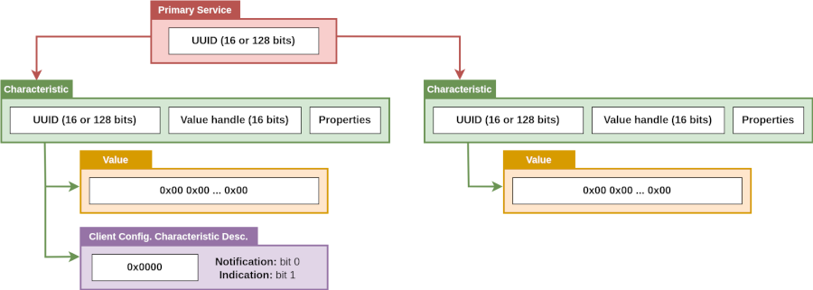

+++
title = 'Explore BLE devices'
draft = false
description = "Scan, connect and interact with BLE devices using off-the-shelf tools"
author = "Damien Cauquil"
date = "2025-10-19T09:00:00+01:00"
type = "page"
icon = "fa-brands fa-bluetooth-b"
color = "blue"
width = "4"
weight = 3
+++

# Exploring with *wble-central*

*WHAD* provides a tool called `wble-central` that acts as a *Central* device and allows:
- scanning for *Bluetooth Low Energy* devices in the viscinity,
- connect to a *BLE* device
- explore a device's GATT attributes and its associated services and characteristics,
- interact with a device's characteristics


In the *Bluetooth specification*, a *Central* device is defined as a device able to
listen to any advertising device and to initiate a connection to any device that is
advertised as *connectable*.


This tool also implements an interactive shell that is very useful to explore devices
in the viscinity without having to write some Python code. To run `wble-central` in
interactive mode, simply execute the following command:

```shell
(whad)$ wble-central -i hci0
```

The `-i` option passed to `wble-central` specifies a *Bluetooth Low Energy* hardware
device that will be used by this tool. This option is mandatory as *WHAD* CLI tools
are not designed to automatically search for a compatible interface to avoid messing
up with compatible devices possibly used by other applications. You should be greeted
with the following prompt:

```shell
wble-central>
```

## Searching for devices

The `scan` command starts an active scan and lists every advertising device based on the
received advertisements, with their names extracted from their advertising information:

```shell
wble-central> scan
 RSSI Lvl  Type  BD Address        Extra info
[-050 dBm] [RND] 6f:e5:8d:32:a2:eb name:"LE-Bose NC 700 HP"
[-080 dBm] [RND] 69:dc:e8:53:8c:a3 
[-078 dBm] [RND] ef:3f:1a:37:c7:72 
[-078 dBm] [RND] ed:af:38:86:1b:70 
[-072 dBm] [PUB] ff:22:07:06:1e:e0 name:"iTAG            "
[-066 dBm] [PUB] ff:22:07:05:0d:c3 name:"iTAG            "
[-036 dBm] [PUB] ff:ff:30:03:70:72 name:"iTAG            "
[-080 dBm] [RND] eb:b9:17:db:e4:cd 
```

Every device discovered during a scan is kept in a cache with all its corresponding details
including its *Bluetooth Device* address, its address type and its name if provided. The
list of cached devices can be displayed at any time thanks to the `devices` command:

```shell
wble-scan> devices
 RSSI Lvl  Type  BD Address        Extra info
[-050 dBm] [RND] 6f:e5:8d:32:a2:eb name:"LE-Bose NC 700 HP"
[-080 dBm] [RND] 69:dc:e8:53:8c:a3 
...
```


In the Bluetooth specification, a *Bluetooth Device* or *BD* address is a unique identifier
for a specific device, that not only identifies a specific device at a specific time but also
gives some additional information about the type of address. Some devices use *resolvable*
addresses that have some specific bits set. These addresses are often mistakenly called *MAC*
addresses as a reference to the well-known network *Media Access Control* addresses used by
network interfaces as their unique identifiers, but the name "*BD* address" is preferred to
avoid confusion.


This cache is used by `wble-central` to feed its auto-completion feature and make it easier
to select a device *BD* address thanks to this feature. Typing the first digits of
an address followed by a press on the [TAB] key will spawn a drop-down list containing all
the matching devices. 

## Connecting to the device

The `connect` command is used to initiate a connection to a given device based on its advertised
name or its *BD* address:

```shell
wble-central>connect ff:ff:30:03:70:72
Successfully connected to target ff:ff:30:03:70:72
wble-central|ff:ff:30:03:70:72>
```

Initiating a connection can take from a few milliseconds to many seconds depending on the
target device advertising settings. If no connection can be established within 30 seconds,
the operation fails and a timeout error is shown. If a connection has successfully been
established, the prompt will reflect this state by indicating the *BD* address of the active
connection.

Once a connection established with a target device we get access to its *GATT* server. This
server, like many web and other application servers, allows a client application like the one
implemented in our *Central* class to exchange data with it and dynamically interact with the
underlying application. This application reacts to data received from the client and may send
back data in response, all of this relying on the *Generic ATTribute Protocol* and its specific
data model.

## Enumerating services and characteristics

A *GATT* server uses *characteristics* to exchange data between the embedded application and a
*GATT* client connected to it, and one or more *services* to group a set of *characteristics*
that are part of the same feature like those used to store the device's generic information or
expose a UART-over-BLE interface. The *GATT* server hosts its own *attributes database*, a
hierarchical structure composed of one or more *services* with one or more *characteristics*
defined in each of them, and a few more different structure used to provide more information
about *characteristics*. Each element defined in this database is an *attribute*, referenced by a unique
16-bit handle, a type UUID and a dedicated buffer used to store the *attribute's value* (bytes),
as defined in the *ATT* protocol upon which is based *GATT*. 

*GATT* simply defines a set of basic attributes, how they are defined, organized and cross-referenced.
The following diagram shows the relations between a *primary service*, some *characteristics* and
their values and descriptors.



A *characteristic*, a *service* and even a *descriptor* is an attribute, all exposed by the *GATT*
server. *Characteristics* are the most interesting type of attributes as they define the key storage
items we use to exchange data with a *Bluetooth Low Energy* device. They are defined by:
- a 16-bit handle value used to uniquely identify the *characteristic* within the *GATT attributes database*
- a 16-bit or 128-bit UUID identifying the *characteristic* within a *service*
- a set of *permissions* that specify the operations a *GATT* client is allowed to perform on the *characteristic*
- an associated value attribute that is used to store the data associated with this characteristic

We need to retrieve this information from the *GATT* server by following a specific procedure implemented in WHAD's
BLE *stack* and initiated by the `profile` command. This command will enumerate every service, characteristic, value
and descriptor attributes and populate them in a cached *GATT* database used by our *Central* device. Once populated,
`wble-central` is able to match a characteristic's UUID with its 16-bit handle and use this handle to exchange
information through well-known *GATT* procedures. *Handles* are used instead of UUIDs to identify attributes because
of their fixed size. Since *handles* are not quite easy to remember, this enumeration process provides a better view
of the hierarchy of *services* and *characteristics*, as well as what we are supposed to be allowed to do with them.

Let's use the `profile` command to start this enumeration on our target device:

```shell
wble-central|ff:ff:30:03:70:72>profile
Service Generic Access (0x1800)

 Device Name (0x2A00) handle: 2, value handle: 3
  | access rights: read, notify
 Appearance (0x2A01) handle: 4, value handle: 5
  | access rights: read

Service Battery (0x180F)

 Battery Level (0x2A19) handle: 7, value handle: 8
  | access rights: read, notify

Service Immediate Alert (0x1802)

 Alert Level (0x2A06) handle: 10, value handle: 11
  | access rights: write, write_without_response, notify

Service FFE0

 FFE1 handle: 13, value handle: 14
  | access rights: read, notify
```

`wble-central` performs this attribute enumeration procedure and displays the discovered hierarchy, detailing
each attribute depending on its type. This hierarchy of attributes defines the device's *GATT* profile, and is
kept in cache by the tool to avoid performing this enumeration procedure each time we need to find the *handle*
of an attribute to read or write.

## Reading a characteristic's value

Once the *GATT profile* retrieved, our *Central* device can read some data exposed by the *GATT* server. The `read`
command implements the *GATT read procedure* to retrieve the value of a given *characteristic*, defined by either its
UUID or *handle*. The two `read` commands issued below target the same characteristic: the first one uses the *characteristic*'s
16-bit UUID while the second one the corresponding *handle* value.

```shell
wble-central|ff:ff:30:03:70:72>read 2a00
00000000: 69 54 41 47 20 20 20 20  20 20 20 20 20 20 20 20  iTAG
wble-central|ff:ff:30:03:70:72>read 3
00000000: 69 54 41 47 20 20 20 20  20 20 20 20 20 20 20 20  iTAG
```


When referring to a *characteristic*'s UUID in `wble-central`, like the *Device Name* characteristic showed above,
the provided UUID is `2a00` and not `0x2a00`. The `0x` prefix is deliberately omitted to avoid confusion between
a characteristic's handle value (an integer) and its *UUID*. Trying to invoke the `read` command with `0x2a00` would
cause the tool to issue a read request on handle `0x2a00`, which should not match any valid handle and lead to an
error or no answer at all, depending on how the BLE stack follows (or not) the specification.


*WHAD* is very permissive by design to allow security researchers to try actions that are not normally supposed to
happen, like trying to read data from a *characteristic*'s value that is marked as write-only for instance:

```shell
wble-central|ff:ff:30:03:70:72>read 2a06
00000000: 00 
```

In the example above, we received the value of the *characteristic* identified by UUID `0x2A06`, that is the *Alert Level*
characteristic defined in the *GATT profile* as write-only:

```
...
Service Immediate Alert (0x1802)

 Alert Level (0x2A06) handle: 10, value handle: 11
  | access rights: write, write_without_response, notify

...
```

Well, that should not be possible based on the permissions defined for this *characteristic* but it looks like the *stack*
behaves quite oddly on this target device.

## Writing data into a characterstic's value 

The same way we read a *characteristic*'s value, we can update its value by using the `write` command. This command takes
a *characteristic*'s UUID or *handle* in parameter, and the new value to write into it. The value to write can be:
- a text string
- a series of bytes defined in hexadecimal

By default, the second argument passed to `write` is considered as a text string and is written into the *characteristic*'s
value. If the text string to write contains whitespaces, it can be put between quotes: `"Some text"`. If the value to write
is not a text string, the second parameter must be 'hex' and be followed by one or more hexadecimal 8-bit values. This series
of 8-bit hexadecimal bytes will be written into the *characteristic*'s value. 

We can trigger an alert for our target device by writing a byte of value `0x01` into the `Alert Level` *characteristic*'s value,
that will put the device in alert mode and forces it to emit a repetitive sound to drag attention:

```shell
wble-central|ff:ff:30:03:70:72>write 2a06 hex 01
```

Similarly to the *GATT read procedure*, *WHAD* is very permissive and allows to write into read-only *characteristics*:

```shell
wble-central|ff:ff:30:03:70:72>read 3
00000000: 69 54 41 47 20 20 20 20  20 20 20 20 20 20 20 20  iTAG            
wble-central|ff:ff:30:03:70:72>write 3 "Ooops..."
wble-central|ff:ff:30:03:70:72>read 3
00000000: 4F 6F 6F 70 73 2E 2E 2E  20 20 20 20 20 20 20 20  Ooops... 
```

It looks like read-only *characteristics* can also be written into (oops).

## Subscribing for notifications or indications

Some *characteristics*  have a specific *Client Configuration Characteristic descriptor* defined in the device's *GATT*
profile, and this *descriptor* is used to tell the device that the *GATT* client would like to be notified whenever the
*characteristic*'s value changes. `wble-central` has a dedicated command to subscribe to *notifications*, `sub`. It accepts
a single parameter specifying the target *characteristic* either by its UUID or *handle*:

```shell
wble-central|7f:f4:b9:df:a1:8a>sub c65b8f2f-aee2-4c89-b758-bc4892d6f2d8
Successfully subscribed to notification for characteristic c65b8f2f-aee2-4c89-b758-bc4892d6f2d8
```
Once subscribed for notifications, `wble-central` will show the *characteristic*'s updated value
whenever the device send notifications to our *Central*.

## Disconnecting

To close an active *Bluetooth Low Energy* connection, we simply use the `disconnect` command:

```shell
wble-central|7f:f4:b9:df:a1:8a>disconnect
Peripheral has just disconnected
wble-central>
```

# Tips and tricks

This section details some tips and tricks that could be useful to get the most of `wble-central`, that we discovered
while developing this tool or even during our previous workshops held during many cybersecurity conferences.

## Environment variables can save a lot of time

*WHAD*'s command-line tools that provide an interactive shell provide specific commands to set, recall and destroy
environment variables. These environment variables are different from the system's, but can basically be used in
a similar way. 

If you plan to connect, disconnect and connect again to a target device, it could save you a lot of time to define
a custom variable and assign the target *BD* address to it to later easily recall this value, as shown below:

```shell
wble-central>set TARGET ff:ff:30:03:70:72
wble-central>connect $TARGET
Successfully connected to target ff:ff:30:03:70:72
wble-central|ff:ff:30:03:70:72>disconnect
Peripheral has just disconnected
wble-central>info $TARGET
Device ff:ff:30:03:70:72
RSSI:			-50 dBm
Address type:		public

Raw advertising records

wble-central>connect $TARGET
Successfully connected to target ff:ff:30:03:70:72
```

The `env` command lists every defined environment variable:

```shell
wble-central|ff:ff:30:03:70:72>env
TARGET=ff:ff:30:03:70:72
```

To destroy the `$TARGET` variable, just execute the `unset TARGET` command.

## Use the interactive shell history

Whenever a *WHAD* command-line tool provides an interactive shell, this shell keeps an history of every previous
command typed. By pressing the *up key* of your keyboard, it will successively recall the previous commands
from the more recent to the oldest. Pressing the *down key* allows to navigate back to more recent commands.
Hitting the *enter* key will run the selected command.
