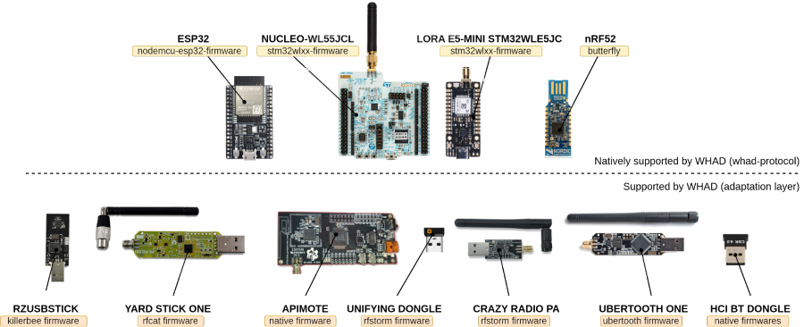

+++
title = '1. Setting up WHAD'
draft = false
description = "Discover WHAD and install it on your computer"
author = "Damien Cauquil"
date = "2025-10-20T09:00:00+01:00"
type = "page"
icon = "fa-solid fa-box-open"
color = "green"
width = "12"
+++

# What is WHAD ?

*WHAD* stands for _**W**ireless_ _**HA**cking_ with _**D**evices_, a short name that took
us some days to agree on before starting working on a small proof of concept. It has been
later read by some contributors as _**W**ireless_ _**H**acking_ for _**D**ummies_, but that's
more a non-intended pun than the official complete name corresponding to this acronym.
Now we simply say _**WHAD**_ *[ˈwɒd]* and it opens a lot of other puns we may use in a future
talk's title 😅 ...

Anyways, *WHAD* is a framework that provides tools to play with wireless devices and networks,
which has been thought to be very flexible to fit a wide range of needs. It can be used to simply
interact with any compatible wireless device (or network) for simple tasks like switching on and
off a Zigbee lightbulb with a small Python script, but also for more complex tasks like creating a
set of custom tools for a proprietary wireless protocol to assess its security.

## WHAD supports many well-known protocols

The framework supports the following wireless protocols:

* **Bluetooth Low Energy**: introduced in the _Bluetooth_ specification version 4.0, it is now a very popular communication
    protocol supported by smartphones and a great number of devices
* **ZigBee**: a wireless network protocol mostly used in home automation systems to interconnect devices and control them through a
    dedicated gateway
* **Logitech Unifying**: a wireless communication protocol used by Logitech's keyboards and mice, prone to multiple vulnerabilities
    that have been partly fixed
* **Enhanced ShockBurst**: another proprietary communication protocol used by lots of wireless keyboards and mice for random brands
* **LoRaWAN**: a low-power _Wide Area Network_ built upon the proprietary _LoRa_ modulation used by many devices to communicate
    with applications hosted in a cloud to generally report measures.

*WHAD* also provides support for low-level modulations with the capability to modulate and demodulate signals when used with
hardware supporting this feature.

## WHAD supports various hardware interfaces

In order to communicate with as much wireless devices as possible, *WHAD* supports two categories of hardware interfaces:

* the native hardware interfaces that run a custom firmware compatible with *WHAD* (these devices *speak* the WHAD protocol)
* other hardware interfaces running their own firmware, not natively able to communicates with *WHAD* but supported through a
    dedicated translation layer





In the end, the following devices are correctly supported:

- nRF52 USB Dongles from Nordic Semiconductor
- ST Microelectronics STM32WL55xx development board
- SeeedStudio's Lora E5 Mini
- Standard Bluetooth 4.x/5.x/6.x USB dongles
- On-board Bluetooth 4.x/5.x/6.x adapters shipped already installed in computer's mainboards
- GreatScott Gadgets Yard Stick One
- GreatScott Gadgets Ubertooth One
- Crazyradio PA
- Riverloop Security / Attify APIMote
- Logitech's Unifying USB dongle


## WHAD provides off-the-shelf tools

The *WHAD* framework provides off-the-shelf tools for various wireless protocols that rely
on its Python API to allow various actions on wireless devices and networks, but also on
PCAP files:

* *Bluetooth Low Energy* scanning and exploration through `wble-central`, `wble-periph` and `wble-proxy`
* *ZigBee* scanning and exploration with `wzb-enddevice`
* *Logitech Unifying* discovery and attacks with `wuni-scan`, `wuni-keyboard` and `wuni-mouse`
* Generic packet capture with `wsniff`
* Generic packet replay with `wplay`
* Generic packet injection with `winject`
* Automated traffic analysis with `wanalyze`
* Live packet monitoring with wireshark through `wshark`
* and much more ...

## WHAD provides a full-featured Python library

All the tools mentioned above are built upon *WHAD*'s Python API, that provides a lot of features
that are for most of them covered in [the official documentation](https://whad.readthedocs.org).
Some features are described and explained in this dedicated learning platform, those missing may
be added in the future.

As an example, scanning *Bluetooth Low Energy* devices in Python using an on-board *USB Bluetooth adapter*
is pretty easy, as demonstrated in the following example:

```python
from whad.device import Device
from whad.ble import Scanner

with Scanner(Device.create("hci0")) as scanner:
    for device in scanner.discover_devices():
        print(device)
```

# Installing WHAD

*WHAD* can be installed natively on your host or in a virtual machine if your
operating system is not compatible. As of today, *WHAD* only works on *Linux*
and *MacOS* but not on *Windows*, with some limitations on *Mac OS* as it does
not natively supports *Bluetooth* USB adapters.

The installation procedure is detailed [in the corresponding chapter in the
documentation](https://whad.readthedocs.io/en/latest/install.html), as some configurations may cause unexpected issues with *WHAD*.
Please refer to it if the following installation procedure fails or if *WHAD* ends up being incorrectly installed on your
machine.

## Recommended setup

*WHAD* works very well on Linux machines but you should pay extra care to the following:
- make sure the version of Python you are using has its `socket` module compiled with support for `AF_BLUETOOTH` socket family
- if you are using a virtual machine, please [disable the USB power-saving feature at the kernel level](https://whad.readthedocs.io/en/latest/install.html#using-vmware-virtualization-software-1)

It is also highly recommended to run *WHAD* inside a *virtual environment*, either managed
by Python's *venv* module or by an external manager like [pyenv](https://github.com/pyenv/pyenv).

Make sure to have the following dependencies installed on your system before running
the above commands:
* Python >= 3.9 interpreter and development headers
* a working compiler with its standard libraries as it is required to build some dependencies

## Installing WHAD on a Linux machine

Most of the time, the following commands are enough to get the framework installed
on a *Linux* machine:

```sh
$ mkdir whad && cd whad
$ python3 -m venv whad-venv
$ . ./whad-venv/bin/activate
(whad-venv)$ pip install --upgrade pip
(whad-venv)$ pip install whad
```

*WHAD* may need some privileges to access some hardware devices. The following
command installs all the required _udev_ rules and permissions:

```sh
$ winstall --rules all
```

You may be asked to enter your password as some commands need _root_ privileges to
run.

## Testing WHAD

Run the following command in the same terminal you used to install *WHAD* (make sure you are
using the correct virtual environment):

```sh
$ wup
```

This command should not produce any error and display all the supported hardware interfaces, if any, or
simply return with no error or warning.


If everything went fine, you managed to install WHAD on your machine and are ready to start your first exercise !
If it is not the case, please refer to WHAD's documentation to troubleshoot your setup.

